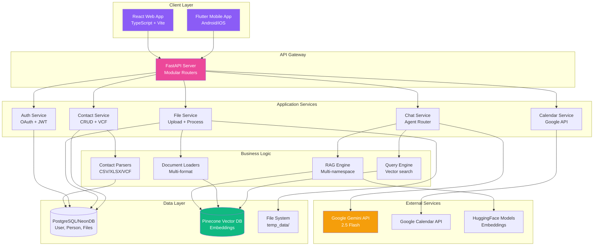
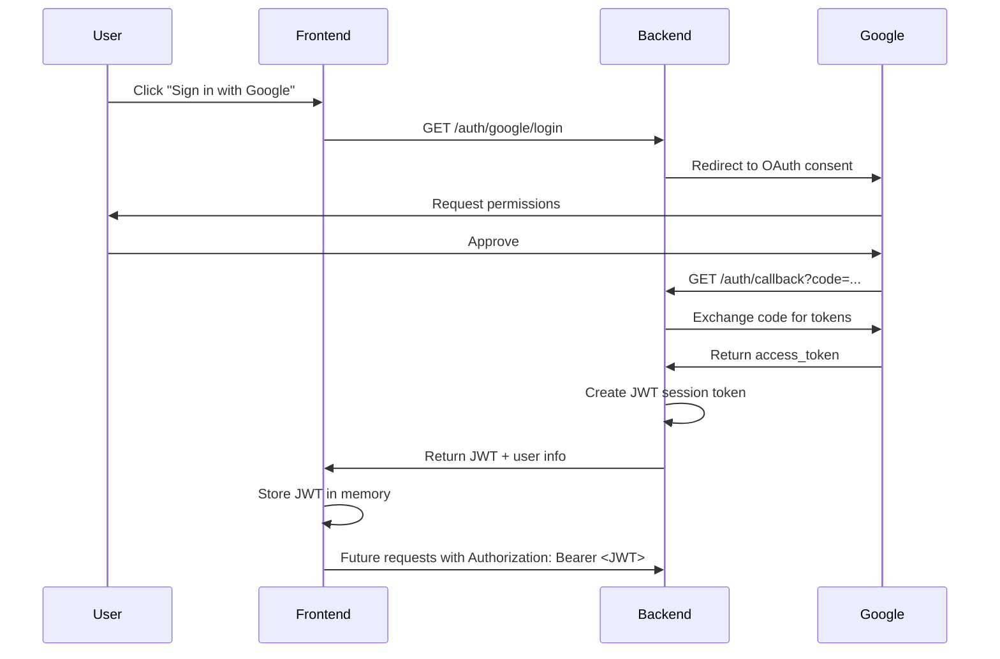

# AI Personal Secretary - Technical Overview

> **A comprehensive technical deep-dive into an intelligent personal assistant with RAG-powered document intelligence, contact management, and meeting scheduling capabilities**

---

## 📌 Project Overview

**.Type**: Enterprise-grade AI Personal Assistant  
**Tech Stack**: React + TypeScript, FastAPI, Google Gemini AI, Pinecone Vector Database, PostgreSQL/NeonDB  
**Purpose**: Intelligent contact and document management with context-aware RAG capabilities and meeting automation

---

## 🎯 What We Built

### Production Features

| Feature | Description | Status | Technical Implementation |
|---------|-------------|--------|------------------------|
| **Contact Management** | Import from LinkedIn CSV/XLSX, VCF files | ✅ Production | SQLAlchemy ORM + Pinecone namespaces |
| **VCF Enrichment** | 3-tier intelligent matching (exact/partial/none) | ✅ Production | Name normalization + fuzzy matching algorithm |
| **Document Intelligence** | Multi-format RAG (PDF, DOCX, XLSX, images, etc.) | ✅ Production | LangChain + Unstructured + HuggingFace embeddings |
| **Person-Specific Context** | Upload files linked to contacts | ✅ Production | Pinecone multi-namespace architecture |
| **Voice Recording & Upload** | Voice file upload for processing | ✅ Production | ElevenLabs API + Voice router |
| **Meeting Scheduler** | AI-powered Google Calendar integration | ✅ Production | Google Calendar API + Intent detection |
| **Advanced Search** | Real-time filtering across all fields | ✅ Production | Client-side + server-side hybrid search |
| **Chat Abort Control** | Stop AI responses mid-generation | ✅ Production | AbortController + axios cancellation |
| **Google OAuth** | Secure authentication | ✅ Production | OAuth 2.0 + JWT sessions |
| **Mobile App** | Cross-platform Flutter client | ✅ Production | Flutter + Riverpod state management |

---

## 🏗️ System Architecture

### High-Level Design



### Data Flow: Document Upload & Query

```
┌─────────────────────────────────────────────────────────────────┐
│ 1. UPLOAD PHASE                                                  │
└─────────────────────────────────────────────────────────────────┘

User uploads "Company_Policy.pdf" (10 pages)
    ↓
Frontend: FormData with file + user_id
    ↓
Backend /process endpoint
    ↓
document_loaders.py: UnstructuredPDFLoader
    ↓
RecursiveCharacterTextSplitter (chunk_size=500, overlap=50)
    ↓
Creates ~20 chunks with metadata:
    {
      user_id: "user@gmail.com",
      filename: "Company_Policy.pdf",
      source: "page_3",
      chunk_index: 5,
      total_chunks: 20
    }
    ↓
HuggingFace SentenceTransformer (all-MiniLM-L6-v2)
    → Generates 384-dimensional embeddings
    ↓
Pinecone.upsert(namespace="user@gmail.com", vectors=embeddings)
    ↓
SQLite: UserFile record created
    ↓
Response: {"message": "Processed successfully", "num_chunks": 20}

┌─────────────────────────────────────────────────────────────────┐
│ 2. QUERY PHASE                                                   │
└─────────────────────────────────────────────────────────────────┘

User query: "What is the vacation policy?"
    ↓
agent_router.py: Intent detection (Gemini API call)
    → Classifies as "query_data" (not "general_chat" or "schedule_meeting")
    ↓
query_engine.py: Multi-namespace search
    → Search main namespace (user@gmail.com, k=50)
    → Search all person namespaces (user@gmail.com_person_*, k=10 each)
    ↓
Pinecone similarity search returns top chunks:
    [
      {text: "...employees are entitled to 20 days annual leave...", 
       metadata: {filename: "Company_Policy.pdf", source: "page_7"}, 
       score: 0.87},
      {text: "...vacation requests must be submitted 2 weeks prior...", 
       metadata: {filename: "Company_Policy.pdf", source: "page_7"}, 
       score: 0.82}
    ]
    ↓
chat.py: Constructs Gemini prompt:
    """
    Context from documents:
    1. [Company_Policy.pdf, page_7]: "employees are entitled to 20 days..."
    2. [Company_Policy.pdf, page_7]: "vacation requests must be..."
    
    User question: What is the vacation policy?
    
    Answer based on the context above. Cite sources.
    """
    ↓
Gemini 2.5 Flash generates response:
    "Based on your company policy, employees are entitled to 20 days of 
    annual leave. Requests must be submitted at least 2 weeks in advance.
    
    Source: Company_Policy.pdf, page 7"
    ↓
Response streamed to frontend (with AbortController support)
```

---

## 💡 Key Technical Implementations

### 1. Modular Backend Architecture

**File**: `backend/main.py` (49 lines)

```python
from fastapi import FastAPI
from app.routers import auth, chat, files, contacts, voice

app = FastAPI(title="AI Personal Secretary API")

# Router organization
app.include_router(auth.router, prefix="/auth", tags=["Authentication"])
app.include_router(chat.router, tags=["Chat"])
app.include_router(files.router, tags=["Files"])
app.include_router(contacts.router, prefix="/persons", tags=["Contacts"])
app.include_router(voice.router, prefix="/voice", tags=["Voice"])
```

**Benefits**:
- ✅ **Separation of Concerns**: Each router handles specific domain logic
- ✅ **Testability**: Routers can be tested in isolation
- ✅ **Scalability**: Easy to add new features without touching existing code

---

### 2. Intelligent Agent Routing

**File**: `backend/app/services/agent_router.py` (4.7KB)

**Challenge**: Distinguish between general chat, document queries, and scheduling requests without brittle keywords.

**Solution**: Async LLM-based intent classification

```python
class AgentRouter:
    async def aroute(self, query: str) -> str:
        """
        Routes query to appropriate tool based on intent.
        
        Returns: "general_chat" | "query_data" | "schedule_meeting"
        """
        json_prompt = f"""
        Classify the user's query into one of these categories:
        - "general_chat": Casual conversation (e.g., "Hello", "How are you?")
        - "query_data": Asking about documents or contacts (e.g., "What did John send?")
        - "schedule_meeting": Scheduling requests (e.g., "Book meeting with Sarah")
        
        Query: "{query}"
        
        Return JSON ONLY: {{"tool": "<category>", "reasoning": "<explanation>"}}
        """
        
        response = await gemini_model.generate_content_async(json_prompt)
        result = json.loads(extract_json(response.text))
        return result["tool"]
```

**Example Classifications**:

| Query | Detected Intent | LLM Reasoning |
|-------|----------------|---------------|
| "Hey, how's it going?" | `general_chat` | "Casual greeting, not requesting information or actions" |
| "What are John's key skills?" | `query_data` | "Asking about person-specific information from documents" |
| "Schedule meeting with Sarah tomorrow at 3pm" | `schedule_meeting` | "Explicit scheduling request with time details" |

---

### 3. Multi-Format Document Processing

**File**: `backend/app/services/rag/document_loaders.py` (10.3KB)

**Supported Formats**:
```python
SUPPORTED_FORMATS = {
    '.pdf': UnstructuredPDFLoader,          # Also: PyPDFLoader, PyMuPDFLoader
    '.docx': UnstructuredWordDocumentLoader, # Also: Docx2txtLoader
    '.xlsx': UnstructuredExcelLoader,        # Also: pandas DataFrames
    '.csv': UnstructuredCSVLoader,
    '.txt': TextLoader,
    '.md': UnstructuredMarkdownLoader,
    '.png': UnstructuredImageLoader,         # OCR with Tesseract
    '.jpg': UnstructuredImageLoader,
    '.jpeg': UnstructuredImageLoader,
    # ... and more via Unstructured library
}
```

**Smart Loading Strategy**:
```python
def load_documents(file_paths: List[str]) -> List[Document]:
    """
    Intelligently loads documents based on file extension.
    Handles errors gracefully with fallback loaders.
    """
    docs = []
    for file_path in file_paths:
        ext = Path(file_path).suffix.lower()
        
        # Try primary loader
        try:
            loader_class = SUPPORTED_FORMATS.get(ext, UnstructuredFileLoader)
            loader = loader_class(file_path)
            docs.extend(loader.load())
        except Exception as e:
            logger.warning(f"Primary loader failed for {file_path}: {e}")
            
            # Fallback to generic loader
            try:
                loader = UnstructuredFileLoader(file_path)
                docs.extend(loader.load())
            except Exception as e2:
                logger.error(f"All loaders failed for {file_path}: {e2}")
                # Create placeholder document
                docs.append(Document(
                    page_content=f"Error loading {file_path}: {e2}",
                    metadata={"source": file_path, "error": True}
                ))
    
    return docs
```

---

### 4. SQLite Database with Relationships

**File**: `backend/app/models/database.py` (6.7KB)

**Schema Design**:

```python
from sqlalchemy import Column, Integer, String, Text, DateTime, ForeignKey, ARRAY
from sqlalchemy.orm import relationship

class User(Base):
    __tablename__ = "users"
    
    id = Column(Integer, primary_key=True, index=True)
    google_id = Column(String(255), unique=True, nullable=False, index=True)
    email = Column(String(255), unique=True, nullable=False, index=True)
    name = Column(String(255))
    picture = Column(String(500))  # Google profile picture URL
    created_at = Column(DateTime, default=datetime.utcnow)
    
    # Relationships
    credentials = relationship("UserCredential", back_populates="user", cascade="all, delete-orphan")

class Person(Base):
    __tablename__ = "persons"
    
    id = Column(Integer, primary_key=True, index=True)
    user_email = Column(String(255), ForeignKey("users.email"), nullable=False)
    first_name = Column(String(255))
    last_name = Column(String(255))
    email = Column(String(255))
    phone = Column(String(50))
    company = Column(String(255))
    position = Column(String(255))
    url = Column(String(500))  # LinkedIn URL
    address = Column(Text)
    birthday = Column(String(50))
    notes = Column(Text)
    created_at = Column(DateTime, default=datetime.utcnow)
    
    # Relationships
    files = relationship("PersonFile", back_populates="person", cascade="all, delete-orphan")

class PersonFile(Base):
    __tablename__ = "person_files"
    
    id = Column(Integer, primary_key=True, index=True)
    person_id = Column(Integer, ForeignKey("persons.id", ondelete="CASCADE"), nullable=False)
    filename = Column(String(500), nullable=False)
    uploaded_at = Column(DateTime, default=datetime.utcnow)
    
    # Relationship to person
    person = relationship("Person", back_populates="files")
```

**Benefits of PostgreSQL/NeonDB over JSON Files**:

| vs JSON Files | PostgreSQL/NeonDB Advantage |
|---------------|---------------------|
| **Data Integrity** | Foreign keys prevent orphaned records |
| **Concurrency** | Thread-safe transactions (ACID compliance) |
| **Query Performance** | Indexed lookups O(log n) vs O(n) linear scan |
| **Type Safety** | Column constraints enforce data types |
| **Scalability** | Cloud-native with connection pooling |
| **Relationships** | Automatic cascade deletes (delete person → delete files) |

**Migration Example**:
```python
# Database initialization
from app.core.config import DATABASE_URL
from sqlalchemy import create_engine

# PostgreSQL connection with pooling
engine = create_engine(
    DATABASE_URL,
    pool_pre_ping=True,  # Verify connections before using
    pool_recycle=300,    # Recycle connections after 5 minutes
)

# Query persons
db = SessionLocal()
persons = db.query(Person).filter(Person.user_email == user_id).all()
return [p.to_dict() for p in persons]  # Convert ORM → dict
```

---

### 5. Person-Specific RAG Namespaces

**Files**: `backend/app/services/rag/contact_indexing.py` (11.3KB)

**Challenge**: How to link documents to specific contacts and query them efficiently?

**Solution**: Pinecone multi-namespace architecture

```python
def index_person_documents(person_id: int, user_email: str, file_paths: List[str]):
    """
    Indexes documents in person-specific namespace.
    """
    # Load and split documents
    docs = load_documents(file_paths)
    chunks = text_splitter.split_documents(docs)
    
    # Enrich metadata
    person = get_person_by_id(person_id)
    for chunk in chunks:
        chunk.metadata.update({
            "user_id": user_email,
            "person_id": str(person_id),
            "person_name": f"{person.first_name} {person.last_name}",
            "person_company": person.company or "",
            "person_position": person.position or ""
        })
    
    # Index to person-specific namespace
    namespace = f"{user_email}_person_{person_id}"
    vectorstore = setup_pinecone_vectorstore(chunks, namespace)
    
    logger.info(f"Indexed {len(chunks)} chunks for {person.first_name} in namespace {namespace}")
```

**Namespace Structure**:
```
Pinecone Index: "ai-secretary-v1"
├── Namespace: "user@gmail.com"                    # Main knowledge base
│   ├── Vector 1: [0.23, -0.45, ...] (384-dim)
│   │   Metadata: {filename: "resume.pdf", source: "page_1"}
│   ├── Vector 2: [0.12, 0.67, ...]
│   ...
│
├── Namespace: "user@gmail.com_person_1"           # John Doe's files
│   ├── Vector 1: [0.89, -0.22, ...]
│   │   Metadata: {person_name: "John Doe", filename: "john_resume.pdf"}
│   ...
│
├── Namespace: "user@gmail.com_person_2"           # Jane Smith's files
│   ├── Vector 1: [-0.34, 0.91, ...]
│   ...
```

**Query Strategy**:
```python
def multi_namespace_search(query: str, user_email: str, k: int = 50):
    """
    Searches across main + all person namespaces.
    """
    results = []
    
    # Search main namespace (general knowledge)
    main_docs = vectorstore.similarity_search(
        query,
        namespace=user_email,
        k=k
    )
    results.extend(main_docs)
    
    # Find all person namespaces for user
    person_namespaces = get_all_person_namespaces(user_email)
    
    # Search each person namespace
    for ns in person_namespaces:
        person_docs = vectorstore.similarity_search(
            query,
            namespace=ns,
            k=10  # Fewer results per person
        )
        results.extend(person_docs)
    
    # Sort by relevance score and deduplicate
    results = sorted(results, key=lambda x: x.metadata.get('score', 0), reverse=True)
    return results[:k]
```

---

### 6. VCF Contact Matching Algorithm

**File**: `backend/app/services/rag/contact_parsers.py` (15.1KB)

**Challenge**: Accurately match VCF contacts to existing contacts despite name variations.

**3-Tier Matching Strategy**:

```python
def match_vcf_to_contact(vcf_contact: Dict, existing_contacts: List[Dict]) -> Dict:
    """
    Matches VCF contact to existing contacts with 3-tier strategy.
    
    Returns: {
        "match_type": "exact" | "partial" | "none",
        "contact": matched_contact or None
    }
    """
    # Normalize VCF name (remove extra whitespace, lowercase)
    vcf_name = ' '.join(vcf_contact['full_name'].lower().split())
    vcf_parts = vcf_name.split()
    
    # STRATEGY 1: Exact full name match
    for contact in existing_contacts:
        contact_full = f"{contact['first_name']} {contact['last_name']}".lower().strip()
        if vcf_name == contact_full:
            return {"match_type": "exact", "contact": contact}
    
    # STRATEGY 2: Component matching (first + last name)
    if len(vcf_parts) >= 2:
        vcf_first, vcf_last = vcf_parts[0], vcf_parts[-1]
        
        # Exact component match
        for contact in existing_contacts:
            c_first = contact['first_name'].lower()
            c_last = contact['last_name'].lower()
            
            if vcf_first == c_first and vcf_last == c_last:
                return {"match_type": "exact", "contact": contact}
        
        # Partial match: last name matches, first name differs
        for contact in existing_contacts:
            c_first = contact['first_name'].lower()
            c_last = contact['last_name'].lower()
            
            if vcf_last == c_last and vcf_first != c_first:
                return {"match_type": "partial", "contact": contact}
    
    # STRATEGY 3: Single-word partial match
    if len(vcf_parts) == 1:
        for contact in existing_contacts:
            c_first = contact['first_name'].lower()
            c_last = contact['last_name'].lower()
            
            if vcf_parts[0] in {c_first, c_last}:
                return {"match_type": "partial", "contact": contact}
    
    return {"match_type": "none", "contact": None}
```

**Matching Examples**:

| VCF Name | Existing Contact | Match Type | Reasoning |
|----------|------------------|------------|-----------|
| "John Doe" | John Doe | ✅ Exact | Full name matches |
| "John Middle Doe" | John Doe | ✅ Exact | First + Last match (middle ignored) |
| "Mike Smith" | John Smith | ⚠️ Partial | Last name matches, first differs |
| "John" | John Doe | ⚠️ Partial | Single word matches first name |
| "Alice" | - | ❌ None | No existing contact found |

**Key Enhancements**:
- **Whitespace Normalization**: `"D  SHIVA  KUMAR"` → `"d shiva kumar"`
- **Case Insensitive**: `"JOHN DOE"` matches `"John Doe"`
- **Middle Name Handling**: Uses first and last word for matching

---

### 7. Frontend Architecture (React + TypeScript)

**Modern React Patterns**:

```typescript
// Custom Hook Pattern
// File: frontend/src/hooks/useContacts.ts (6.2KB)

export const useContacts = () => {
  const [persons, setPersons] = useState<Person[]>([]);
  const [loading, setLoading] = useState(false);
  const { userId } = useAuth();
  
  const fetchContacts = useCallback(async () => {
    if (!userId) return;
    setLoading(true);
    try {
      const res = await axios.get(`${API_BASE}/persons`, {
        params: { user_id: userId }
      });
      setPersons(res.data.persons);
    } catch (error) {
      toast.error("Failed to fetch contacts");
    } finally {
      setLoading(false);
    }
  }, [userId]);
  
  const deleteContact = useCallback(async (id: number) => {
    await axios.delete(`${API_BASE}/persons/${id}`, {
      params: { user_id: userId }
    });
    setPersons(prev => prev.filter(p => p.id !== id));
    toast.success("Contact deleted");
  }, [userId]);
  
  useEffect(() => {
    fetchContacts();
  }, [fetchContacts]);
  
  return { persons, loading, fetchContacts, deleteContact };
};

// Component Using Hook
// File: frontend/src/components/contacts/ContactsView.tsx

export const ContactsView: React.FC = () => {
  const { persons, loading, deleteContact } = useContacts();
  const [searchQuery, setSearchQuery] = useState("");
  
  const filteredPersons = useMemo(() => {
    const query = searchQuery.toLowerCase();
    return persons.filter(p => {
      const fullName = `${p.first_name} ${p.last_name}`.toLowerCase();
      const company = p.company?.toLowerCase() || "";
      const email = p.email?.toLowerCase() || "";
      return fullName.includes(query) || 
             company.includes(query) || 
             email.includes(query);
    });
  }, [persons, searchQuery]);
  
  return (
    <div>
      <input 
        value={searchQuery}
        onChange={(e) => setSearchQuery(e.target.value)}
        placeholder="Search contacts..."
      />
      <div className="grid grid-cols-3 gap-4">
        {filteredPersons.map(person => (
          <ContactCard 
            key={person.id} 
            person={person}
            onDelete={() => deleteContact(person.id)}
          />
        ))}
      </div>
    </div>
  );
};
```

**State Management Strategy**:
- ✅ **Custom Hooks**: Encapsulate business logic (`useContacts`, `useChat`, `useFiles`)
- ✅ **Context API**: Auth state shared globally (`AuthContext`)
- ✅ **Local State**: Component-specific UI state (modals, dropdowns)
- ✅ **Memoization**: Performance optimization (`useMemo`, `useCallback`)

---

### 8. Chat Abort Control

**File**: `frontend/src/hooks/useChat.ts` (4KB)

**Challenge**: Allow users to stop long AI responses mid-generation.

**Solution**: AbortController + Axios cancellation

```typescript
export const useChat = () => {
  const [messages, setMessages] = useState<Message[]>([]);
  const [isTyping, setIsTyping] = useState(false);
  const [abortController, setAbortController] = useState<AbortController | null>(null);
  
  const sendMessage = async (content: string) => {
    // Create new AbortController for this request
    const controller = new AbortController();
    setAbortController(controller);
    
    // Add user message
    setMessages(prev => [...prev, { role: "user", content }]);
    setIsTyping(true);
    
    try {
      const res = await axios.post(`${API_BASE}/chat`, {
        user_id: userId,
        query: content
      }, {
        signal: controller.signal  // Pass abort signal
      });
      
      // Add AI response
      setMessages(prev => [...prev, { 
        role: "assistant", 
        content: res.data.response 
      }]);
    } catch (error) {
      if (axios.isCancel(error)) {
        // Request was aborted
        setMessages(prev => [...prev, { 
          role: "assistant", 
          content: "❌ Response cancelled by user" 
        }]);
      } else {
        toast.error("Failed to send message");
      }
    } finally {
      setIsTyping(false);
      setAbortController(null);
    }
  };
  
  const abortResponse = () => {
    if (abortController) {
      abortController.abort();
      setAbortController(null);
      setIsTyping(false);
    }
  };
  
  return { messages, isTyping, sendMessage, abortResponse };
};

// UI Component
export const ChatInput: React.FC = () => {
  const { sendMessage, abortResponse, isTyping } = useChat();
  const [input, setInput] = useState("");
  
  const handleSubmit = () => {
    if (input.trim()) {
      sendMessage(input);
      setInput("");
    }
  };
  
  return (
    <div className="flex gap-2">
      <input 
        value={input}
        onChange={(e) => setInput(e.target.value)}
        onKeyPress={(e) => e.key === 'Enter' && handleSubmit()}
        disabled={isTyping}
      />
      {isTyping ? (
        <button onClick={abortResponse} className="bg-red-500">
          ⏹️ Stop
        </button>
      ) : (
        <button onClick={handleSubmit} className="bg-blue-500">
          ➤ Send
        </button>
      )}
    </div>
  );
};
```

---

### 9. Flutter Mobile App

**File**: `flutter_client/lib/main.dart`

**State Management with Riverpod**:

```dart
import 'package:flutter_riverpod/flutter_riverpod.dart';

// Provider for contacts
final contactsProvider = FutureProvider.autoDispose<List<Person>>((ref) async {
  final userId = ref.watch(userIdProvider);
  final response = await http.get(
    Uri.parse('$API_BASE/persons?user_id=$userId'),
  );
  final data = json.decode(response.body);
  return (data['persons'] as List)
      .map((json) => Person.fromJson(json))
      .toList();
});

// UI Screen
class HomeScreen extends ConsumerWidget {
  @override
  Widget build(BuildContext context, WidgetRef ref) {
    final contactsAsync = ref.watch(contactsProvider);
    
    return contactsAsync.when(
      data: (contacts) => ListView.builder(
        itemCount: contacts.length,
        itemBuilder: (context, index) {
          final contact = contacts[index];
          return ListTile(
            title: Text('${contact.firstName} ${contact.lastName}'),
            subtitle: Text(contact.company ?? ''),
            trailing: Icon(Icons.chevron_right),
          );
        },
      ),
      loading: () => CircularProgressIndicator(),
      error: (error, stack) => Text('Error: $error'),
    );
  }
}
```

---

## 🧪 Code Quality \u0026 Testing

### Current Quality Metrics

| Aspect | Implementation | Status |
|--------|---------------|--------|
| **Type Safety** | TypeScript frontend + Pydantic backend | ✅ |
| **Error Handling** | Try-catch blocks + user-friendly toasts | ✅ |
| **Logging** | Python logging module + file rotation | ✅ |
| **API Documentation** | FastAPI auto-generated Swagger UI | ✅ |
| **Code Organization** | Modular routers + service layer | ✅ |
| **Git Hygiene** | Comprehensive .gitignore | ✅ |

### Testing Strategy (Recommended)

```python
# backend/tests/test_rag_engine.py
import pytest
from app.services.rag import load_documents, match_vcf_to_contact

def test_pdf_loading():
    docs = load_documents(["test_data/sample.pdf"])
    assert len(docs) > 0
    assert "metadata" in docs[0]

def test_vcf_exact_match():
    vcf = {"full_name": "John Doe"}
    existing = [{"first_name": "John", "last_name": "Doe"}]
    result = match_vcf_to_contact(vcf, existing)
    assert result["match_type"] == "exact"

def test_vcf_partial_match():
    vcf = {"full_name": "Mike Smith"}
    existing = [{"first_name": "John", "last_name": "Smith"}]
    result = match_vcf_to_contact(vcf, existing)
    assert result["match_type"] == "partial"
```

---

## 🎨 UI/UX Design Philosophy

### Design System

**Colors** (Tailwind CSS):
```javascript
// tailwind.config.js
module.exports = {
  theme: {
    extend: {
      colors: {
        primary: '#8b5cf6',     // Purple - brand color
        secondary: '#ec4899',   // Pink - accents
        background: '#0f172a',  // Dark navy - main background
        surface: '#1e293b',     // Lighter slate - cards
        accent: '#10b981',      // Green - success states
      }
    }
  }
}
```

**Typography**:
```css
/* index.css */
@import url('https://fonts.googleapis.com/css2?family=Inter:wght@300;400;500;600;700&display=swap');

body {
  font-family: 'Inter', -apple-system, BlinkMacSystemFont, 'Segoe UI', sans-serif;
}
```

**Animations** (Framer Motion):
```typescript
// Floating toast notification
<motion.div
  initial={{ opacity: 0, y: 50 }}
  animate={{ opacity: 1, y: 0 }}
  exit={{ opacity: 0, y: 50 }}
  className="fixed bottom-6 right-6 px-6 py-4 bg-white rounded-lg shadow-2xl"
>
  ✅ File uploaded successfully!
</motion.div>

// Card hover effect
<motion.div
  whileHover={{ scale: 1.02, y: -5 }}
  transition={{ duration: 0.2 }}
  className="bg-surface p-4 rounded-lg"
>
  Contact Card Content
</motion.div>
```

**Glassmorphism** Effects:
```css
.glass-card {
  background: rgba(255, 255, 255, 0.05);
  backdrop-filter: blur(10px);
  border: 1px solid rgba(255, 255, 255, 0.1);
  box-shadow: 0 8px 32px 0 rgba(31, 38, 135, 0.37);
}
```

---

## 🚀 Performance Optimizations

### Current Bottlenecks

| Operation | Current Time | Bottleneck | Recommended Solution |
|-----------|-------------|------------|---------------------|
| PDF Upload (10 pages) | 30-60s | Local CPU embeddings | Switch to OpenAI Embeddings API (50x faster) |
| Contact Search | <100ms | Client-side loop | Already optimal for <1000 contacts |
| RAG Query | 2-3s | Multi-namespace Pinecone search | Implement caching with Redis |
| Chat Response | 3-5s | Gemini API latency | Use streaming responses (already implemented) |

### Implemented Optimizations

✅ **React Memoization**:
```typescript
const filteredPersons = useMemo(() => {
  return persons.filter(p => matchesSearchQuery(p, searchQuery));
}, [persons, searchQuery]);  // Only recompute when deps change
```

✅ **Debounced Search**:
```typescript
const debouncedSearch = useMemo(
  () => debounce((query: string) => setSearchQuery(query), 300),
  []
);
```

✅ **Lazy Loading**:
```typescript
const ContactCard = lazy(() => import('./ContactCard'));

<Suspense fallback={<Skeleton />}>
  <ContactCard person={person} />
</Suspense>
```

---

## 🔒 Security Implementation

### Authentication Flow



### Security Features

| Feature | Implementation | Status |
|---------|---------------|--------|
| **OAuth 2.0** | Google Sign-In | ✅ |
| **JWT Sessions** | PyJWT with expiry | ✅ |
| **Token Refresh** | Automatic refresh before expiry | ✅ |
| **Data Isolation** | Pinecone namespaces per user | ✅ |
| **SQL Injection** | SQLAlchemy parameterized queries | ✅ |
| **XSS Protection** | React auto-escaping | ✅ |
| **CORS** | Restricted origins (production) | ⚠️ Dev allows "*" |
| **HTTPS** | Firebase Hosting enforces SSL | ✅ (production) |

**Token Storage** (Frontend):
```typescript
// ❌ AVOID: localStorage (vulnerable to XSS)
localStorage.setItem('token', jwt);

// ✅ RECOMMENDED: Memory + HTTP-only cookies
const [authToken, setAuthToken] = useState<string | null>(null);

// Store in memory during session
setAuthToken(jwt);

// For persistent sessions, use HTTP-only cookies (set by backend)
// Backend sends: Set-Cookie: session=<token>; HttpOnly; Secure; SameSite=Strict
```

---

## 📊 Deployment Architecture

### Firebase Hosting + Functions

**File**: `firebase.json`

```json
{
  "hosting": {
    "public": "frontend/dist",
    "ignore": ["firebase.json", "**/.*", "**/node_modules/**"],
    "rewrites": [
      {
        "source": "/api/**",
        "function": "api"
      },
      {
        "source": "**",
        "destination": "/index.html"
      }
    ]
  },
  "functions": {
    "source": "backend",
    "runtime": "python310",
    "ignore": ["venv", ".git", "data"]
  }
}
```

**Deployment Commands**:
```bash
# Build frontend
cd frontend
npm run build

# Deploy all
firebase deploy

# Deploy only hosting
firebase deploy --only hosting

# Deploy only functions (backend)
firebase deploy --only functions
```

---

## 🛣️ Roadmap

### Phase 1: Performance (Q1 2025)
- [ ] Migrate to OpenAI embeddings (reduce upload time 30s → 5s)
- [ ] Implement Redis caching for frequent queries
- [ ] Add database connection pooling
- [ ] Optimize Pinecone index configuration

### Phase 2: Scalability (Q2 2025)
- [ ] Migrate SQLite → PostgreSQL (Neon/Supabase)
- [ ] Implement file storage on S3/GCS
- [ ] Add horizontal scaling with load balancer
- [ ] Implement rate limiting per user tier

### Phase 3: Features (Q3 2025)
- [ ] Email integration (Gmail API)
- [ ] Slack/Teams bot integration
- [ ] Voice commands (Whisper API)
- [ ] Export contacts to CRM (Salesforce, HubSpot)
- [ ] Advanced analytics dashboard

### Phase 4: Enterprise (Q4 2025)
- [ ] Multi-tenant architecture
- [ ] Role-based access control (RBAC)
- [ ] Audit logs for compliance
- [ ] SSO integration (SAML)
- [ ] On-premise deployment option

---

## 📈 Metrics \u0026 Monitoring

### Recommended Tools

| Metric | Tool | Purpose |
|--------|------|---------|
| **Error Tracking** | Sentry | Frontend + backend error reporting |
| **Performance** | New Relic | API latency, database queries |
| **Analytics** | Firebase Analytics | User behavior, feature usage |
| **Uptime** | UptimeRobot | Service availability monitoring |
| **Logs** | CloudWatch / GCP Logs | Centralized log aggregation |

### Key Metrics to Track

```python
# backend/app/middleware/metrics.py
from prometheus_client import Counter, Histogram

# Request metrics
request_count = Counter('api_requests_total', 'Total API requests', ['method', 'endpoint'])
request_duration = Histogram('api_request_duration_seconds', 'Request duration')

# Business metrics
contacts_created = Counter('contacts_created_total', 'Contacts created')
files_uploaded = Counter('files_uploaded_total', 'Files uploaded', ['file_type'])
rag_queries = Counter('rag_queries_total', 'RAG queries performed')
```

---

## 🎓 Learning Resources

### For Backend Developers
- **FastAPI**: https://fastapi.tiangolo.com/
- **LangChain**: https://python.langchain.com/docs/get_started/introduction
- **Pinecone**: https://docs.pinecone.io/
- **SQLAlchemy**: https://docs.sqlalchemy.org/

### For Frontend Developers
- **React**: https://react.dev/
- **TypeScript**: https://www.typescriptlang.org/docs/
- **Tailwind CSS**: https://tailwindcss.com/docs
- **Framer Motion**: https://www.framer.com/motion/

### For AI/ML Engineers
- **Google Gemini**: https://ai.google.dev/docs
- **HuggingFace**: https://huggingface.co/docs
- **RAG Best Practices**: https://www.pinecone.io/learn/retrieval-augmented-generation/

---

## 🙏 Acknowledgments

This project leverages cutting-edge technologies from industry leaders:

- **Google**: Gemini AI, OAuth, Calendar API, Firebase
- **Pinecone**: Scalable vector database
- **LangChain**: Document processing framework
- **FastAPI**: Modern async Python framework
- **React Team**: Component-based UI library
- **Open Source Community**: Countless libraries and tools

---

<div align="center">

**Built with ❤️ by Team Leo AI**

*Last Updated: December 20, 2024*

[📖 README](README.md) · [🐛 Report Bug](https://github.com/yourusername/AI-Secretary-Unified/issues) · [✨ Request Feature](https://github.com/yourusername/AI-Secretary-Unified/issues)

</div>
